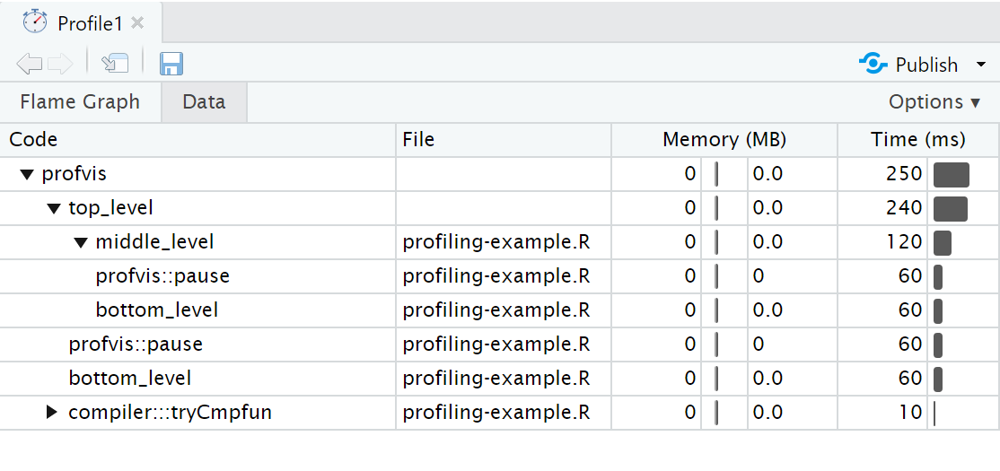

```{r setup, include=FALSE}
options(digits = 4)
options(width = 67)
library(knitr)
library(kableExtra)
opts_chunk$set(echo = TRUE, dev = "png", dpi = 300,
               comment = "#", eval = TRUE, 
               fig.width = 5, fig.height = 5, 
               knitr.table.format = "markdown")
# trim white space top and right of plot
knit_hooks$set(small.mar = function(before, options, envir) {
    if (before) par(mar = c(4, 5, 2, 1))
})
# trim white space when par won't work
library(magick)
knit_hooks$set(crop = function(before, options, envir) {
    if (before || isTRUE((fig.num <- options$fig.num) == 0L))
        return()
    paths = fig_path(options$fig.ext, options, fig.num)
    for (f in paths) image_write(image_trim(image_read(f)), f)
})
# function to put ``` when compiling Rmd
ticks <- function() "```"
set.seed(1)
```

class: inverse middle

# Profiling

---

# Profiling code

To make our code more efficient, we first need to identify the bottlenecks, in 
terms of time and/or memory usage.

Profiling stops the execution of code every few milliseconds and records 
 - The call stack: the function currently being executed, the function that it 
 was called from and so on up to the top-level function call.
 - The memeory allocated and released since the last record.
 
We will use the **profvis** package to visualise profiling results.
 
---

# Example: nested pause functions

The following code is saved in `profiling-example.R` and uses `profvis::pause` 
to wait 0.1s inside each function

```r
top_level <- function() {
  profvis::pause(0.1)
  middle_level()
  bottom_level()
}
middle_level <- function() {
  profvis::pause(0.1)
  bottom_level()
}
bottom_level <- function() {
  profvis::pause(0.1)
}
```
???
`Sys.sleep()` can not be used as it would not show in profiling output

---

# Using profvis

Source the code to be profiled and pass the function call to be profiled to 
`profvis()`
```{r, eval = FALSE}
library(profvis)
source("profiling-example.R")
profvis(top_level())
```

An interactive HTML document will open with the results.

In RStudio this will open in the source pane, click "show in new window" button to open the document in a new window.

---


---

# Interpretation

The bottom plot is called a *flame graph*.

The yellow bars in the flame graph correspond to lines in the source file shown above, for which time has been recorded.

In the overall time of 250ms we see 
 - 4 equal-sized blocks for each pause of 0.1s
 - Nearly all time is spent in the top-level function
 - Nearly half the time is spent in the mid-level function
 - Nearly half the time is also spent in the bottom-level function as it is called twice
 - There is one sample where the `cmp` function is being executed (called by compiler:::tryCmpfun). When a function is first called, R attempts to compile it to byte code so that it can call the compiled version in subsequent calls.
 
No changes in memory are recorded as no objects are created or deleted.

---

# Data tab

The Data tab shows a table with the memory and time usage for each function call. The nested calls can be expanded/collapsed to show/hide the lines of the table nested within a particular call.


```{r, eval = FALSE}
devtools::install_github("csgillespie/efficient",
                         INSTALL_opts = "--with-keep.source",
                         force = TRUE)
library("efficient")
profvis(simulate_monopoly(10000))
```

---

# Memory profiling

To illustrate memory profiling we can consider a loop that concatenates values.

As it is a small code snippet, we can pass to profvis directly

```{r, eval = FALSE}
profvis({
  x <- integer()
  for (i in 1:10000) {
    x <- c(x, i)
  }
})
```

---


---

# <GC>

As expected, the majority of the time is spent within `c()`, but we also see a lot time spent in `<GC>`, the garbage collector.

In the memory column next to the corresponding line in the source code, we see a bar to left labelled -123.0 and a bar to the right labelled 137.2. This means that 137 MB of memory was allocated and 123 MB of memory was released.

This is because each call to `c()` causes a new copy of `x` to be created.

Memory profiling can help to identify short-lived objects that might be avoided by changes to the code.

---

# General principles


* Avoid optimizing too soon
  - Get the code right first.
  - Write tests to validate changes to the code
* Avoid over-optimization
  - Focus on the bottlenecks
  - Keep an eye on the units - will real gains be made?
  - Think about maintainability: readability, simplicity, dependencies
* Avoid anonymous functions
  - Name utility functions to see them in the profile
* Use microbenchmarking to assess alternative implementations
  
---

# Monopoly

In the monopoly board game, players roll two die to move round the board. Players buy assets on which they can charge rent or taxes and aim to make the most money.

The squares on the board represent
- Properties, train stations or utility companies to buy
- Events that trigger an action, e.g. paying a tax or going to jail

The *efficient* package contains the `simulate_monopoly()` function to simulate game play, which we'll use to practice profiling.

---

# Your Turn

1. Install the *efficient* package with the following code to keep the code source files:
```r
remotes::install_github("csgillespie/efficient",
                         INSTALL_opts = "--with-keep.source")
```
2. Use `profvis()` to profile `simulate_monopoly(10000)`. Explore the output. Which parts of the code are slow?
3. Most of the time is spent in the underlying function `move_square()`. Use `View(move_square)` to view the source code. Make two copies of the code in separate .R files and name the functions `move_square` and `move_square2`. Edit `move_square2` to speed up the slow parts of the code. (Go to next slide for testing the updates)

---

Use `bench::mark()` to test your changes. Create a wrapper for each function to run it `n` times with different seeds, e.g.
```{r, eval = FALSE}
run_move_square <- function(n){
  x <- numeric(n)
  for (i in 1:n) {
    set.seed(i)
    x[i] <- move_square(1)
  }
  x
}
```
Then run `bench::mark(run_move_square(n), run_move_square2(n))` for suitable `n`. This ensures the new code gives the same results!

When you think you have done as much improvement as you can, compare `profvis(run_move_square2(10000))` with `profvis(run_move_square(10000))`.

---

class: inverse middle

# Using R with C++

---

# Limits of R

Sometimes you reach the limits of R:
  - Your code is still slow despite optimizing the computational approach and the R implementation
  - You could speed up the R code, but it results in very obscure, convoluted code
  
In this case it can make sense to code parts in C++

---

# Typical scenarios

There are some typical scenarios where C++ is likely to be a good idea

- Loops that can't be vectorized because iterations depend on previous
results
- Recursive functions, or problems which involve calling functions millions of times.
- Problems that require advanced data structures and algorithms that R doesn’t provide. 

???
The overhead of calling a function in C++ is much lower than in R.

---

# C++ basics

Consider an R function `add_r()` to add two numbers
```r
add_r <- function(x, y) x + y
```
Here's how we might write an equivalent `add_cpp()` function in C++
```{cpp, eval = FALSE}
double add_cpp(double x, double y) { 
  double value = x + y;
  return value;
}
```
- The type for the return value is declared first
- The type of each argument must be declared
- The type of intermediate objects must be declared
- Return statements must use `return`

---

# Rcpp

To use `add_cpp()` in R we need to compile the C++ code and construct and R function that connects to the compiled C++ function. 

The R package **Rcpp** takes care of these steps for us. 

One way is to use the `cppFunction()`, e.g.

```{r}
library(Rcpp)
cppFunction('
  double add_cpp(double x, double y) {
    double value = x + y;
    return value;
  }
')
```

---

After defining `add_cpp()` via `cppFunction()`, `add_cpp()` is available to use as a R function
```{r}
add_cpp
add_cpp(3, 5)
```

---

# Stand-alone C++ files

It is better to define functions in C++ files (extension `.cpp`). These files will be recognised by RStudio and other IDEs, with the usual benefits.

The C++ file should have these lines at the top:
```{cpp, eval = FALSE}
#include <Rcpp.h>
using namespace Rcpp;
```
 - The compiler will locate the Rcpp header file with functions and class definitions supplied by *Rcpp* and include the contents.
 - Adding the namespace means that we can use Rcpp function in the C++ code without prefxing the function names by `Rcpp::`.
 
Above each function we want to use in R, add `// [[Rcpp::export]]`

---

# Example C++ file

The following is in the file `add_cpp2.cpp`

```{cpp, eval = FALSE}
#include <Rcpp.h>
using namespace Rcpp;

// [[Rcpp::export]]
double add_cpp2(double x, double y) {
  double value = x + y;
  return value;
}
```

---

# `sourceCpp()`

Now we can use `sourceCpp()` to make the C++ functions available in R

```{r}
sourceCpp("add_cpp2.cpp")
add_cpp2(5, 9)
```
???
could put benefits here: syntax highlighting, avoid mistakes switching from R to C code, line numbers for compilation errors, highlighting errors (e.g. missing ";")


---

# C++ Basics

 - Every statement within `{` `}` must be terminated by a `;`.
 - Use `=` for assignment (`<-` is not valid).
 - Addition, subtraction, multiplication and division use the same operators as R (`+`, `-`, `*`, `/`).
 - Comparison operators are the same as R (`==`, `!=`, `>`, etc)
 - One-line comments start with `//`.
 - Multi-line comments use `/*` `*/` delimiters

---

# Data types

The basic C++ data types are scalars. **Rcpp** provides vector versions

| R         | C++ (scalar) | Rcpp (vector)   |
|-----------|--------------|-----------------|
| numeric   | double       | NumericVector   |
| integer   | int          | IntegerVector   |
| character | char         | CharacterVector |
| logical   | bool         | LogicalVector   |

**Rcpp** also provides `String` as an alternative to `char`

???
Care needed with NA
double: more bits used to represent a real number vs single precision
 - range 2^-(2^10) to 2^(2^10). vs same with 2^7
 - precision ~15 d.p. vs 7
 
---

# Example: no inputs, scalar output

```{cpp, eval = FALSE}
int one() {
  return 1;
}
```

---

# Example: if/else (scalar input, scalar output)

```{cpp, eval = FALSE}
int signC(int x) {
  if (x > 0) {
    return 1;
  } else if (x == 0) {
    return 0;
  } else {
    return -1;
  }
}
```

---

# For loop syntax

A C++ for loop has the form
```{cpp, eval = FALSE}
for(int i = 0; i < n; ++i) {
  total += x[i];
}
```
- Syntax: `for(initialisation; condition; increment)`
    - Initialize integer `i` at zero
    - Continue as long as `i` is less than `n`
    - Increment `i` by 1 after each iteration (`++i` is `i = i + 1`)
- `total += x[i]` is `total = total + x[i]`
- **Vector indices start at zero**

---

# Example: for loop (vector input, scalar output)

```{cpp, eval = FALSE}
double sumC(NumericVector x) {
  int n = x.size();
  double total = 0;
  for(int i = 0; i < n; ++i) {
    total += x[i];
  }
  return total;
}
```

- Use `.size()` method to find the length of a vector

---

# Example: while loop (vector input, scalar output)

```{cpp, eval = FALSE}
double sumC(NumericVector x) {
  int n = x.size();
  double total = 0;
  int i = 0;
  while (i < n) {
    total += x[i];
    ++i;
  }
  return total;
}
```

- Use `break` to break from a while or for loop
- Use `continue` to skip to the next iternation (vs `next` in R)

---

# Example: vector output

The following computes the Euclidean distances 
$$d_i  = \sqrt{(x - y_i)^2}$$

```{cpp, eval = FALSE}
NumericVector distC(double x, NumericVector y) {
  int n = y.size();
  NumericVector out(n);
  for(int i = 0; i < n; ++i) {
    out[i] = sqrt(pow(ys[i] - x, 2.0));
  }
  return out;
}
```

`out(n)` is used to create a numeric vector named `out` of length `n`. `v(n)` would create a vector named `v`.

---

# Rcpp Functions

`pow` is a standard C++ functon for computing a value raised to a power. However, **Rcpp** defines a vectorized version of this.

Look for available functions loaded with Rcpp header
- In the [Official API documentation](https://dirk.eddelbuettel.com/code/rcpp/html/files.html) (click on Rcpp > sugar > functions)
- In the [Unofficial API documentation](https://thecoatlessprofessor.com/programming/cpp/unofficial-rcpp-api-documentation/)

---

# Your Turn

1. Create a new C++ file to work in. Add the headers required for Rcpp.
2. Convert the following R function that computes a weighted mean to C++
```{r}
wmean_r <- function(x, w){
  n <- length(x)
  total <- total_w <- 0
  for (i in 1:n){
    total <- total + x[i] * w[i]
    total_w <- total_w + w[i]
  }
  total/total_w
}
```
3. Use `sourceCpp()` to source in your function. Use `bench::mark()` to compare `wmean_r()`, `wmean_cpp()` and thet **stats** function `weighted.mean()`.

```{cpp, include = FALSE}
double wmean_cpp(NumericVector x, NumericVector w) {
  int n = x.size();
  double total = 0, total_w = 0;
  for(int i = 0; i < n; ++i) {
    total += x[i] * w[i];
    total_w += w[i];
  }
  return total / total_w;
}
```

---

# Missing values in C++ data types

C++ data types do not handle `NA`s in input well
- `int`: use a length 1 `IntegerVector` instead
- `double`: `NA`s okay (converted to `NAN`)
- `char`: use `String` instead
- `bool`: `NA`s converted to `true`; use `int` instead

---

# Missing values in Rcpp vectors

Rcpp vectors handle `NA`s in the corresponding type

| Rcpp (vector)   | NA         |
|-----------------|------------|
| NumericVector   | NA_REAL    |
| IntegerVector   | NA_INTEGER |
| CharacterVector | NA_LOGICAL |
| LogicalVector   | NA_STRING  |

---

# Matrices

Each vector type has a corresponding matrix equivalent: `NumericMatrix`, `IntegerMatrix`, `CharacterMatrix` and `LogicalMatrix`. 

Create a matrix called named `m1`
```{cpp, eval = FALSE}
NumericMatrix m1(10, 5);
```

- Subset with `()`, e.g. `m1(3, 2)` for the value in row 3, column 2.
- **Rcpp** enables selection of whole row, e.g. `m1(3,_)`, or column, e.g. `m1(_,2)`
- The first element is `m1(0, 0)`.
- Use `.nrow` and `.ncol` methods to get the number of rows and columns 

---

# Example: row sums (matrix input, vector output)

```{cpp, eval = FALSE}
NumericVector rowSumsC(NumericMatrix x) {
  int nrow = x.nrow(), ncol = x.ncol();
  NumericVector out(nrow);
  
  for (int i = 0; i < nrow; i++) {
    double total = 0;
    for (int j = 0; j < ncol; j++) {
      total += x(i, j);
    }
    out[i] = total;
  }
  return out;
}
```

---

# Statistical distributions

As in R, Rcpp provides d/p/q/r functions for the density, distribution function, quantile function and random generation.
- Functions in the `Rcpp::` namespace return a vector.
- Functions in the `R::` namespace return a scalar

---

# Your Turn

```{r}
gibbs_r <- function(N, thin) {
  mat <- matrix(nrow = N, ncol = 2)
  x <- y <- 0

  for (i in 1:N) {
    for (j in 1:thin) {
      x <- rgamma(1, 3, y * y + 4)
      y <- rnorm(1, 1 / (x + 1), 1 / sqrt(2 * (x + 1)))
    }
    mat[i, ] <- c(x, y)
  }
  mat
}
```

``````{cpp, eval = FALSE}
#include <Rcpp.h>
using namespace Rcpp;

// [[Rcpp::export]]
NumericMatrix gibbs_cpp(int N, int thin) {
  NumericMatrix mat(N, 2);
  double x = 0, y = 0;

  for(int i = 0; i < N; i++) {
    for(int j = 0; j < thin; j++) {
      x = rgamma(1, 3, 1 / (y * y + 4))[0];
      y = rnorm(1, 1 / (x + 1), 1 / sqrt(2 * (x + 1)))[0];
    }
    mat(i, 0) = x;
    mat(i, 1) = y;
  }

  return(mat);
}
```


---

# Rcpp sugar: vectorized functions

```{cpp, eval = FALSE}
NumericVector distC(double x, NumericVector y) {
  int n = y.size();
  NumericVector out(n);
  for(int i = 0; i < n; ++i) {
    out[i] = sqrt(pow(ys[i] - x, 2.0));
  }
  return out;
}
```

```{cpp, eval = FALSE}
NumericVector dist_sugar(double x, NumericVector y) {
  return sqrt(pow(x - y, 2));
}
```

---

# Rcpp sugar: 

https://gallery.rcpp.org/articles/simulating-pi/

---

# Rcpp sugar: row maximums

```{cpp, eval = FALSE}
NumericVector row_max(NumericMatrix mat) {
  int nrow = mat.nrow();
  NumericVector max(nrow);
  for (int i = 0; i < nrow; i++)
    max[i] = max( m(i,_) );
  return max;
}
```

---

# References

Similar scope to this module:
Gillespie, C and Lovelace, R, _Efficient R programming_, _Rcpp section_, https://csgillespie.github.io/efficientR/performance.html#rcpp

Going a bit further:
Wickham, H, _Advanced R_ (2nd edn), _Rewriting R code in C++ chapter_, https://adv-r.hadley.nz/rcpp.html

Not very polished, but broader coverage of Rcpp functionality:
Tsuda, M.E., _Rcpp for everyone_, https://teuder.github.io/rcpp4everyone_en/300_Rmath.html

Case studies (optimising by improving R code and/or using C++)
https://robotwealth.com/optimising-the-rsims-package-for-fast-backtesting-in-r/
https://gallery.rcpp.org/articles/bayesian-time-series-changepoint/ ([Rcpp Gallery](https://gallery.rcpp.org/) has all sorts of examples, many illustrating advanced features of Rcpp).


???
Masaki Tsuda

TODO 
Simulating pi [stat functions]
Gibbs sampler example [marices]

MAYBE
evalCpp()


